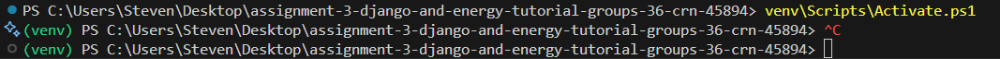

Django ORM Standalone With Interactive Cash Register Application
=====================


This project uses the database components of Django without using the rest of Django (i.e. running a web server)! This project is built off of [Dan Caraon's Django-ORM](https://github.com/dancaron/Django-ORM) project. :tada: Our project takes advantage of Django ORM Standalone to implement a simple, randomized cash register. It does not use the request/response functionalty of a client/server web application that Django also provides, which means it is made to run locally. 

:gear: Requirements
-------------------
- Last tested successfully with Python 3.11.9 and Django 5.2.8
- Create venv and pip install django to import the required modules.

:open_file_folder: File Structure
---------------------------------
```
assignment-3-django-and-energy-tutorial-groups-36-crn-45894/
├── db/
│   ├── __init__.py
│   └── models.py
├── main.py
├── manage.py
├── products_file.txt
├── README.md
└── settings.py
```

__The [main.py](main.py) file is the entry point for the project, and where you can run this repositiory from. You automatically get access to the item model via ```from db.models import *```
Think of it like a plain old python file, but now with the addition of Django's feature-rich models.__ :smiling_face_with_three_hearts:

__The [db/models.py](db/models.py) file is for configuring typical Django models.__ There is a item model used in creating the interactive, random cash register. After running the migrations command in the quick setup below, a db.sqlite3 file will be generated. The settings.py file is where can swap out the sqlite3 database for another database connection, such as Postgres or AmazonRDS, if you wish. For most applications, sqlite3 will be powerful enough. But if you need to swap databases down the road, you can easily do so, which is one of the benefits of using the Django ORM.

__The [db/__init__.py](db/__init__.py) file is for marking the db directory as a package.__ This allows files like [db/models.py](db/models.py) to be loaded in other locations as a module inside the [db](db/) directory. You can also use it initalize any code that may need to be imported when used as a module for the first time. However, our ```__init__.py``` file is empty so it only fulfills the purpose of marking the directory as a package.

__The [manage.py](manage.py) file is the standard entry point for running all Django management commands, and is needed in every Django project.__ It includes a shebang line, allowing the script to be executed as a command using a Unix-system. It also gives Django the location of the project's settings file, which is an essential file for loading and using Django. It also ensures that the settings file is executed before the any other code is run. 

__The [settings.py](settings.py) file is central configuration file for any Django project. It contains all necessary variables and settings that tell Django how to function.__ You can find that we are using sqlite3 as our database engine, and the only Django application that will be active is ```db```. Quite a simple setup.

__The [products_file.txt](products_file.txt) is the data file for all of the items that will be available to be scanned.__ Its contents will be read and stored into the database upon running main.py.

:rocket: Quick Setup (Run These Line-by-Line)
--------------------
Clone this repository into your local machine (Using Command Prompt). You can alternatively use your favorite IDE's Source Control features to clone this repository
```
git clone https://github.com/OTUSOFE365025/assignment-3-django-and-energy-tutorial-groups-36-crn-45894.git grp-36-assignment-3

cd grp-36-assignment-3
```
Create a virtual environment (Windows Machine with Powershell) and install django
```
python -m venv venv 

venv\Scripts\Activate.ps1

pip install django
```
Initialize the database
```
python manage.py makemigrations db

python manage.py migrate
```
Run the project
```
python main.py
```

:crystal_ball: Example Screen Dumps
----------------------
Make sure your new environment is prepended by ```(venv)```:


After going through Quick Setup:


:mortar_board: Django Models
----------------------------

Link: [How to Use Django Models](https://docs.djangoproject.com/en/3.1/topics/db/models/)